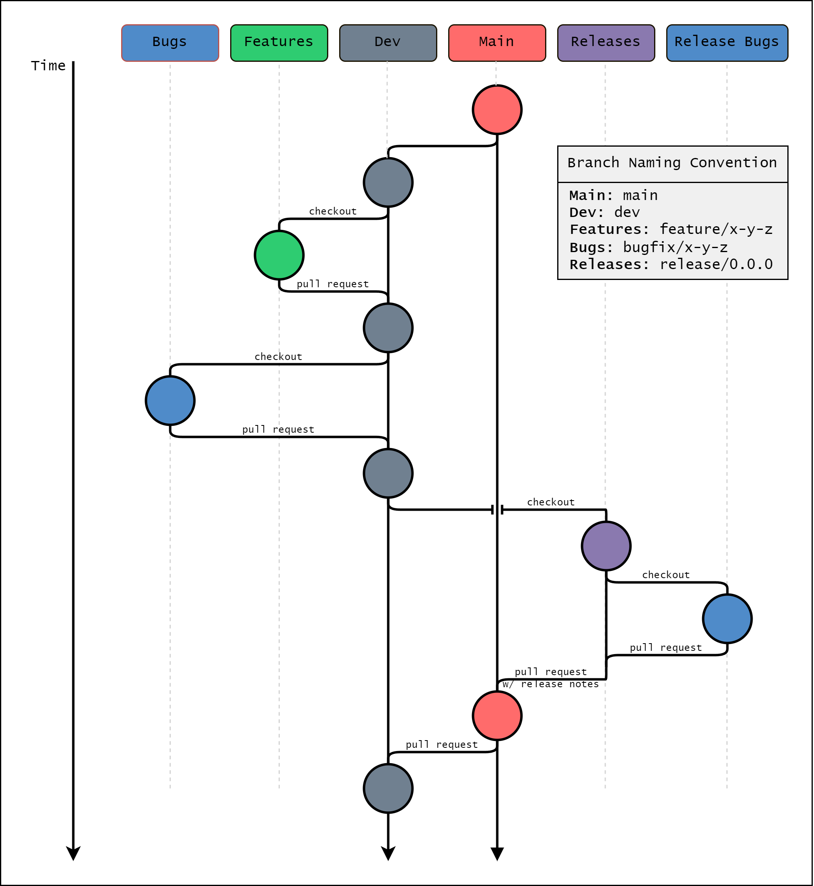

# Contributing to `hecstac`

We welcome any and all collaboration that meets out minimum quality requirements. The branch strategy below details how new features and bug fixes should be approached.

<div align='center'>
   
</div>

<details>
<summary> Developer Setup </summary>

Create a virtual environment in the project directory:

```
$ python -m venv venv
```

Activate the virtual environment:

```
# For macOS/Linux
$ source ./venv/bin/activate
(venv) $

# For Windows
> ./venv/Scripts/activate
```

Install dev dependencies:

```
(venv) $ pip install -e .[dev]
```
</details>


<details>
<summary> Testing HEC-RAS model item creation </summary>

- Download the HEC-RAS example project data from USACE. The data can be downloaded [here](https://github.com/HydrologicEngineeringCenter/hec-downloads/releases/download/1.0.33/Example_Projects_6_6.zip).

- Per the [examples](https://hecstac.readthedocs.io/en/latest/user_guide.html), set the ras_project_file to the path of the 2D Muncie project file (ex. ras_project_file = `Example_Projects_6_6/2D Unsteady Flow Hydraulics/Muncie/Muncie.prj`).

- For projects that have projection information within the geometry .hdf files, the CRS info can automatically be detected. The Muncie data lacks that projection info so it must be set by extracting the WKT projection string and setting the CRS in 'new_ras_item.py' to the projection string. The projection can be found in the Muncie/GIS_Data folder in Muncie_IA_Clip.prj.

- Once the CRS and project file location have been set, a new item can be created with 'python -m new_ras_item' in the command line. The new item will be added inside the model directory at the same level as the project file.

</details>

<details>
<summary> Release checklist </summary>

### Branching
- Merge all changes (features and bugfixes) into `dev`
- Check out a new release branch with name `release/x.x.x`
- If readthedocs latest is tracking dev, verify build manually.

### PyPi Versioning
- Update version in `version.py`
- Update docs
 - Double check dostrings are updated
 - Does the readme need updates?
 - Does ci_cd_diagrams need to be updated?
 - Should anything be changed on read the docs?

### Pull Requests
- Submit PR to `main`.
- Write draft release notes and save as draft release
    - https://github.com/Dewberry/****/releases
- Once approved, merge into `main`.

### Verify
- Double check pypi
- Delete stale branches
</details>
</details>
