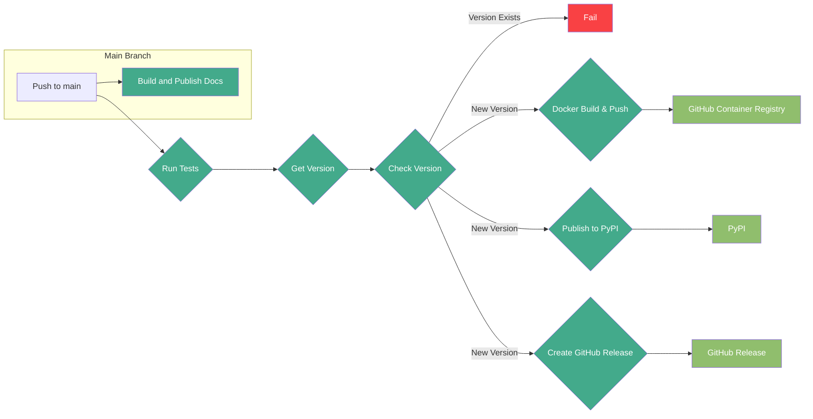
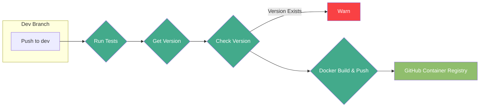
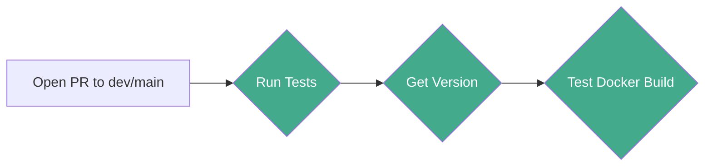

# CI/CD Pipeline

The CI/CD pipeline is managed with GitHub Actions and automates the build, test, and release processes.

### Push to `main` CI/CD Process Diagram

### Push to `dev` CI/CD Process Diagram

### Open PR to `dev`/`main` CI/CD Process Diagram

### Docs

The `Read the Docs` build and publish step is triggered on push to the `main` branch and handled externally by `Read the Docs`.
