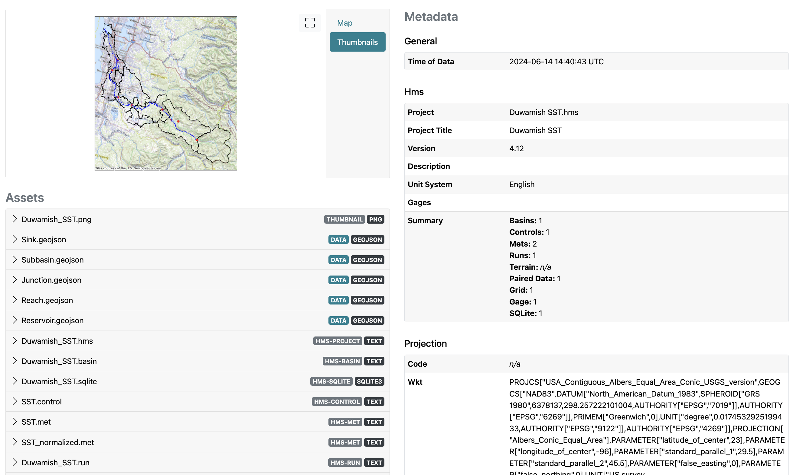
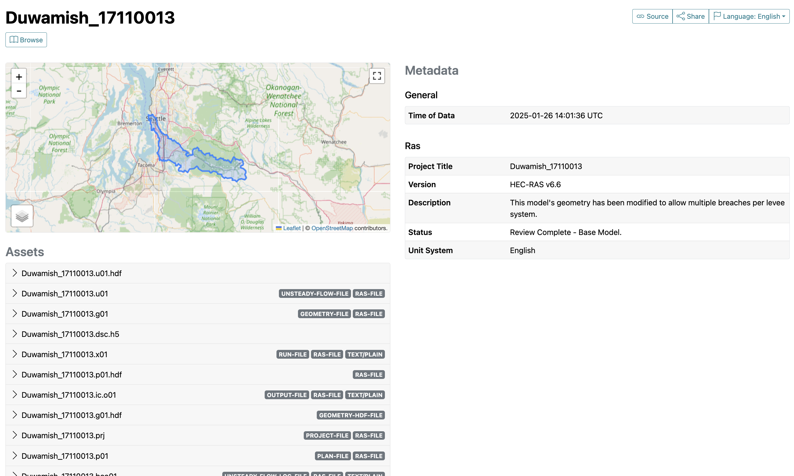
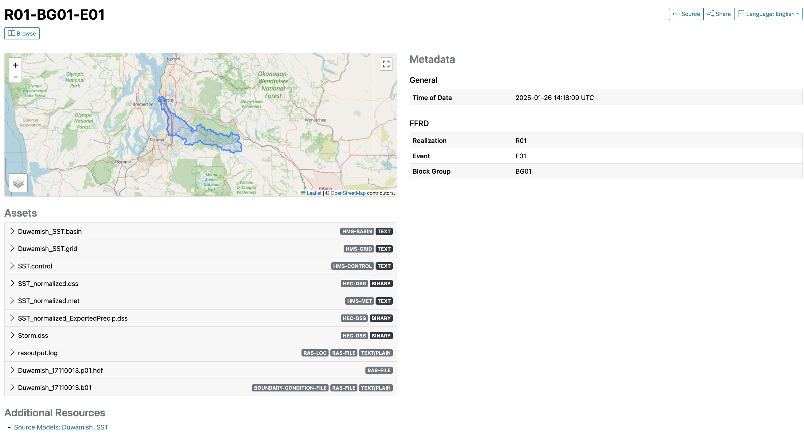

################
Getting Started
################

This section provides a high level overview for using hecstac.

Installation
------------

`hecstac` is registered with `PyPI <https://pypi.org/project/hecstac>`_
and can be installed simply using python's pip package installer. Assuming you
have Python already installed and setup:

   .. code-block:: bash

      pip install hecstac

Note that it is highly recommended to create a python `virtual environment
<https://docs.python.org/3/library/venv.html>`_ to install, test, and run hecstac.

Workflows
---------

The following snippets provide examples for creating stac items from HEC model data.

.. code-block:: python

   # HEC-HMS Item
   from hecstac.common.logger import initialize_logger
   from hecstac.hms.item import HMSModelItem

   if __name__ == "__main__":
      initialize_logger()
      hms_project_file = "/<path-to-file>/model.hms"
      item_id = "hydrologic-model-1"
      asset_dir = "/<path-to-assets>/assets" # Location to store created assets

      hms_item = HMSModelItem.from_prj(hms_project_file, item_id, asset_dir=asset_dir)
      hms_item.save_object(hms_item.pm.item_path(item_id))

.. code-block:: python

   # HEC-RAS Item
   from hecstac.common.logger import initialize_logger
   from hecstac.ras.item import RASModelItem

   if __name__ == "__main__":
      initialize_logger()
      ras_project_file = "/<path-to-file>/ras-model.prj"
      crs="EPSG:4326"
      assets_list = [
         "/<path-to-assets>/ras-model.p01.hdf",
         "/<path-to-assets>/ras-model.b01",
         "/<path-to-assets>/rasoutput.log",
      ]
      ras_item = RASModelItem.from_prj(ras_project_file, crs=crs, assets=assets_list)
      # Note: if no assets are passed, .from_prj() will add any files matching the format ras-model.*
      # ras_item = RASModelItem.from_prj(ras_project_file, crs=crs)
      ras_item.save_object(ras_item.pm.item_path(item_id))

The following snippet provides an example of how to create stac items for an event based simulation.

.. code-block:: python

   from pystac import Item

   from hecstac.common.logger import initialize_logger
   from hecstac.events.ffrd import FFRDEventItem

   if __name__ == "__main__":
      initialize_logger()

      # HMS Info
      hms_source_model_item_path = "/<local-file-dr>/authoritative-hms-model.json"
      hms_source_model_item = Item.from_file(hms_source_model_item_path)
      hms_simulation_files = [
         "<local-file-dr>/hms-model.basin",
         "<local-file-dr>/hms-model.grid",
         "<local-file-dr>/hms-model.control",
         "<local-file-dr>/hms-model.dss",
         "<local-file-dr>/hms-model.met",
         "<local-file-dr>/Precip.dss",
      ]

      # RAS Info
      ras_source_model_item_path = "/<local-file-dr>/authoritative-ras-model.json"
      ras_source_model_item = Item.from_file(ras_source_model_item_path)
      ras_simulation_files = [
         "/<local-file-dr>rasoutput.log",
         "/<local-file-dr>ras-model.p01.hdf",
         "/<local-file-dr>ras-model.b01",
      ]

      # Event Info
      realization = "R01"
      block_group = "BG01"
      event_id = "E01"

      ffrd_event_item_id = f"{realization}-{block_group}-{event_id}"
      dest_href = f"/<local-file-dr>/{ffrd_event_item_id}.json"

      ffrd_event_item = FFRDEventItem(
         ras_simulation_files=ras_simulation_files,
         source_model_paths=[ras_source_model_item],
         event_id=event_id,
         realization=realization,
         block_group=block_group,
         hms_simulation_files=hms_simulation_files,
      )

      ffrd_event_item.save_object(dest_href=dest_href)

Viewing Results
---------------
Example Items created from the Duwamish watershed.

HMS Item
--------

RAS Item
--------

Event Item
----------

Troubleshooting
----------------

For help troubleshooting, please add an issue on github at `<https://github.com/fema-ffrd/hecsta/issues>`_